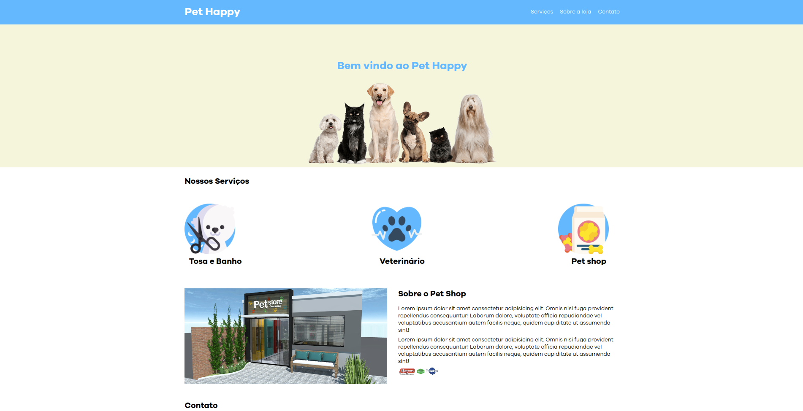

# curso_ebac_frontend

This repository just was created to conclued a module of Fronted in [EBAC Course](https://ebaconline.com.br/front-end-profession).

## About project

Final Project of Module 3. The purpose of the project is to put into practice what was taught throughout the HTML and CSS modules.

It was suggested to create a site similar to the one presented but with a free theme, to the student's liking.

My choice was a project for a website with the intention of being a business card for a pet shop, I chose this theme because I have 3 dogs and I constantly need to go to them 🐕

